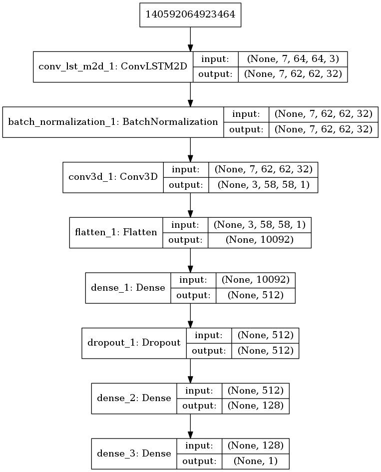

# Liveness detection in replay attacks

This mini-project was created as a test task for Sberbank job interview. I was interested in applying ConvLSTM to the problem of liveness detection.
Since the most common datasets require access request, I've decided to create my own small dataset. Creating such dataset for replay attacks is pretty staightforward so I've decided to go on with that type of attack.
In replay attack a perpetrator shows to the camera recording of the person, for example on mobile phone. The task is then to decide whether camera sees a real person or the recording.

## Dataset
Dataset can be downloaded here https://www.dropbox.com/s/bslj3bqn8oyan1o/videos.zip?dl=0
It consists of three real and three fake videos (denoted with word "real" or "fake" respectively).
Videos were recorded using webcam of MacBook Pro (Retina, 15-inch, Mid 2015), videos were then replayed on Samsung Galaxy Note 2 and recorded using same webcam.

## Model
Model is pretty simple, it takes as input 7 consecutive frames, passes them through ConvLSTM2D, the output is then goes to Conv3D and then a couple of Dense layers.

## Requirements
The code is using [face recognition library](https://github.com/ageitgey/face_recognition) which requires dlib. [Installation instructions for dlib](https://gist.github.com/ageitgey/629d75c1baac34dfa5ca2a1928a7aeaf)
For the rest of the requirements check requirements.txt
